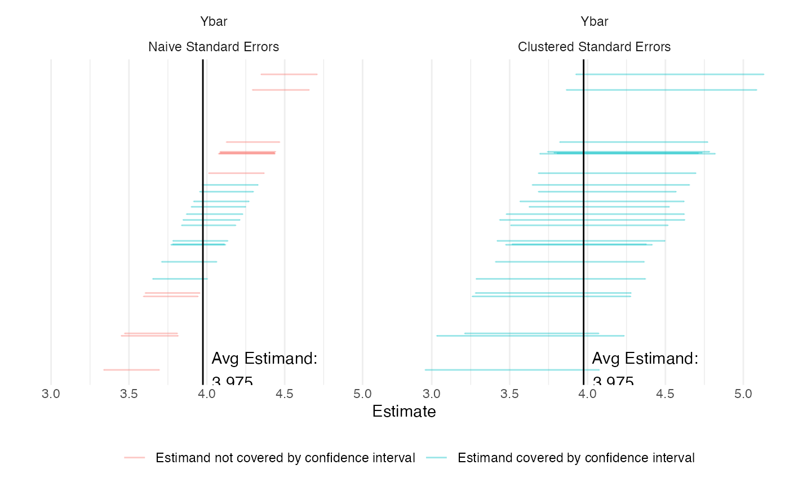

# Cluster Sampling

Researchers often cannot randomly sample at the individual level because
it may, among other reasons, be too costly or logistically impractical.
Instead, they may choose to randomly sample households, political
precincts, or any group of individuals in order to draw inferences about
the population. This strategy may be cheaper and simpler but may also
introduce risks of less precise estimates.

Say we are interested in the average party ideology in the entire state
of California. Using cluster sampling, we randomly sample counties
within the state, and within each selected county, randomly sample
individuals to survey.

Assuming enough variation in the outcome of interest, the random
assignment of equal-sized clusters yields unbiased but imprecise
estimates. By sampling clusters, we select groups of individuals who may
share common attributes. Unlike simple random sampling, we need to take
account of this intra-cluster correlation in our estimation of the
standard error.[^1] The higher the degree of within-cluster similarity,
the more variance we observe in cluster-level averages and the more
imprecise are our estimates.[^2] We address this by considering
cluster-robust standard errors in our answer strategy below.

## Design Declaration

- **M**odel:

  We specify the variable of interest $`Y`$ (political ideology, say) as
  a discrete variable ranging from 1 (most liberal) to 7 (most
  conservative). We do not define a functional model since we are
  interested in the population mean of $`Y`$. The model also includes
  information about the number of sampled clusters and the number of
  individuals per cluster.

- **I**nquiry:

  Our estimand is the population mean of political identification $`Y`$.
  Because we employed random sampling, we can expect the value of the
  sample mean ($`\widehat{\overline{y}}`$) to approximate the true
  population parameter ($`\widehat{\overline{Y}}`$).

- **D**ata strategy:

  Sampling follows a two-stage strategy. We first draw a random sample
  30 counties in California, and in each county select 20 individuals at
  random. This guarantees that each county has the same probability of
  being included in the sample and each resident within a county the
  same probability of being in the sample. In this design we estimate
  $`Y`$ for n = 600 respondents.

- **A**nswer strategy:

  We estimate the population mean with the sample mean estimator:
  $`\widehat{\overline{Y}} = \frac{1}{n} \sum_1^n Y_i`$, and estimate
  standard errors under the assumption of independent and
  heteroskedastic errors as well as cluster-robust standard errors to
  take into account correlation of errors within clusters. Below we
  demonstrate the the imprecision of our estimated
  $`\widehat{\overline{Y}}`$ when we cluster standard errors and when we
  do not in the presence of an intracluster correlation coefficient
  (ICC) of 0.402.

``` r

N_blocks <- 1
N_clusters_in_block <- 1000
N_i_in_cluster <- 50
n_clusters_in_block <- 30
n_i_in_cluster <- 20
icc <- 0.402

fixed_pop <- declare_population(block = add_level(N = N_blocks), 
    cluster = add_level(N = N_clusters_in_block), subject = add_level(N = N_i_in_cluster, 
        latent = draw_normal_icc(mean = 0, N = N, clusters = cluster, 
            ICC = icc), Y = draw_ordered(x = latent, breaks = qnorm(seq(0, 
            1, length.out = 8)))))()
population <- declare_population(data = fixed_pop)
estimand <- declare_inquiry(mean(Y), label = "Ybar")
stage_1_sampling <- declare_sampling(S1 = strata_and_cluster_rs(strata = block, 
    clusters = cluster, n = n_clusters_in_block), filter = S1 == 
    1)
stage_2_sampling <- declare_sampling(S2 = strata_rs(strata = cluster, 
    n = n_i_in_cluster), filter = S2 == 1)
clustered_ses <- declare_estimator(Y ~ 1, .method = lm_robust, 
    clusters = cluster, inquiry = estimand, label = "Clustered Standard Errors")
cluster_sampling_design <- population + estimand + stage_1_sampling + 
    stage_2_sampling + clustered_ses
```

## Takeaways

``` r

diagnosis <- diagnose_design(cluster_sampling_design, sims = 25)
```

    ## Warning: We recommend you choose a number of simulations higher than 30.

| Estimator | Mean Estimand | Mean Estimate | Bias | SD Estimate | RMSE | Power | Coverage |
|:---|:---|:---|:---|:---|:---|:---|:---|
| Clustered Standard Errors | 3.97 | 4.04 | 0.06 | 0.21 | 0.22 | 1.00 | 0.96 |
|  | (0.00) | (0.05) | (0.05) | (0.02) | (0.03) | (0.00) | (0.04) |

To appreciate the role of clustering better we also plot simulated
values of our estimand with standard errors not clustered and with
clustered standard errors. To do this we first add an additional
estimator to the design that does not take account of clusters.

``` r

new_design <- cluster_sampling_design + declare_estimator(Y ~ 1,
                                        .method =lm_robust,
                                        inquiry = estimand,
                                        label = "Naive Standard Errors")
diagnosis <- diagnose_design(new_design, sims = 25)
```



The figure above may give us the impression that our estimate with
clustered standard errors is less precise, when in fact, it correctly
accounts for the uncertainty surrounding our estimates. The blue lines
in the graph demonstrate the estimates from simulations which contain
our estimand. As our table and graphs show, the share of these
simulations over the total number of simulations, also known as
coverage, is (correctly) close to 95% in estimations with clustered
standard errors and 54% in estimations without clustered standard
errors. As expected, the mean estimate itself and the bias is the same
in both specifications.

## References

Murray, David M. 1998. *Design and Analysis of Group-Randomized Trials*.
Vol. 29. Monographs in Epidemiology & B.

[^1]: The intra-cluster correlation coefficient (ICC) can be calculated
    directly and is a feature of this design.

[^2]: In ordinary least square (OLS) models, we assume errors are
    independent (error terms between individual observations are
    uncorrelated with each other) and homoskedastic (the size of errors
    is homogeneous across individuals). In reality, this is often not
    the case with cluster sampling.
