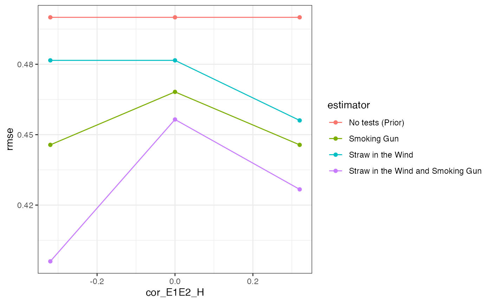

# Process-Tracing

Scholars sometimes employ explicitly Bayesian procedures to evaluate
“cause of effects” claims using qualitative data: how probable is the
hypothesis that $`X`$*did in fact* cause $`Y`$? Fairfield and Charman
(2017), for example, estimate the probability that the right-wing
changed position on tax reform during the 2005 Chilean presidential
election ($`Y`$) *because* of anti-inequality campaigns ($`X`$) by
examining whether the case study narrative bears evidence that you would
only expect to see if this were true.[^1]

In this design, a researcher evaluates a specific hypothesis, $`H`$,
according to which $`Y`$ only happened *because* $`X`$ happened. They
look for “clues” or evidence, $`E`$, in a case narrative or other
qualitative data, which would be more or less surprising to see
depending on whether $`H`$ is true. In our example we’ll imagine they
choose one country in which there was a civil war ($`Y`$) and natural
resources ($`X`$), and look for evidence ($`E`$) that helps update
beliefs about $`Pr(H)`$—the probability that the civil war happened
*because* natural resources were present.

## Design Declaration

- **M**odel:

  Logically, there are four possible causal relationships between $`X`$
  and $`Y`$:

  1.  Natural resources could cause civil war when present, resulting in
      the absence of civil war when natural resources are absent ($`X`$
      causes $`Y`$).

  2.  The presence of natural resources could be the only thing
      preventing war, so that their absence causes civil war ($`\neg X`$
      causes $`Y`$).

  3.  Civil war might happen irrespective of whether natural resources
      are present ($`Y`$ irrespective of $`X`$).

  4.  Civil war might not happen irrespective of whether natural
      resources are present ($`\neg Y`$ irrespective of $`X`$)

  Our model of the world specifies the probability that a given country
  has natural resources as well as the (independent) proportion of
  countries that have one of the causal pathways 1-4.

- **I**nquiry:

  We want to figure out if, in the case we chose, the civil war happened
  *because of* the natural resources ($`H`$) or would have happened
  regardless of natural resources ($`\neg H`$).

- **D**ata strategy:

  We pick one case in which $`X`$ and $`Y`$ are both true (a country
  with natural resources where a civil war happened).

- **A**nswer strategy:

  We’ll evaluate the likelihood of our causal hypothesis, $`H`$, by
  looking for evidence, $`E`$, that would be more or less surprising to
  see if $`X`$ truly did cause $`Y`$. Specifically, we’ll use Bayes’
  rule to figure out $`Pr(H \mid E)`$: the posterior probability that
  $`X`$ caused $`Y`$ in the case we chose, given the evidence we found.
  We make a function that calculates
  $`Pr(H \mid E) = \frac{Pr(H) Pr(E|H)}{Pr(H)Pr(E\mid(H)) + Pr(\neg H)Pr(E\mid\neg H)}`$.

  To use Bayes’ rule in conjunction with our evidence, we need to
  specify a few things. First, a prior $`Pr(H)`$ that the hypothesis is
  true. Second and third, we need to state the probabilities with which
  we would observe a piece of evidence if our hypothesis is true
  ($`Pr(E|H)`$) or false ($`Pr(E|\neg H)`$).

  Let’s say, for example, that $`E_1`$ is the national army taking
  control over natural resources during a civil war. That’s very likely
  to happen if the natural resources caused the war. We might say
  $`Pr(E_1 \mid H) = .8`$. But even if the natural resources didn’t
  cause the war, the national army might still take over natural
  resources for other reasons, say $`Pr(E_1 \mid \neg H) = .2`$. This
  type of clue is often called a “straw-in-the-wind” (SIW): you expect
  to see it if $`H`$ is true, but it’s not completely surprising to see
  it if $`H`$ is false.

  We might look for a second clue: just prior to the civil war, was an
  armed group created whose main name, aims, and ideology were centered
  around the capture and control natural resources, and were they also
  one of the main antagonists? Observing such a clue is really unlikely
  overall, even if $`H`$ is true. But it’s very informative if it is
  observed, since it’s so unlikely to happen if $`H`$ is not true: that
  would make the second clue a “smoking gun” (SMG). Let’s say
  $`Pr(E_2 \mid H) = .3, Pr(E_2 \mid \neg H) = 0`$.

  We’ll compare approaches in which a researcher doesn’t look for any
  evidence, only looks for a SIW, and only looks for a SMG. In practice,
  researchers seldom pre-commit to updating from a single piece of
  evidence, but search for multiple clues and updating about their cause
  of effects hypotheses jointly. Doing so in fact requires that we
  specify the joint distribution of the clues. There is often good
  reason to think clues could be correlated, conditional on the
  hypothesis being true or false: for example, the fact that an armed
  group formed in order to take resources ($`E_2`$) might convince the
  government to take over the natural resource ($`E_1`$), or dissuade
  them!

``` r

N <- 100
prob_X <- 0.5
process_proportions <- c(0.25, 0.25, 0.25, 0.25)
prior_H <- 0.5
p_E1_H <- 0.8
p_E1_not_H <- 0.2
p_E2_H <- 0.3
p_E2_not_H <- 0
cor_E1E2_H <- 0
cor_E1E2_not_H <- 0
label_E1 <- "Straw in the Wind"
label_E2 <- "Smoking Gun"

population <- declare_population(N = N, causal_process = sample(x = c("X_causes_Y", 
    "Y_regardless", "X_causes_not_Y", "not_Y_regardless"), 
    size = N, replace = TRUE, prob = process_proportions), 
    X = rbinom(N, 1, prob_X) == 1, Y = (X & causal_process == 
        "X_causes_Y") | (!X & causal_process == "X_causes_not_Y") | 
        (causal_process == "Y_regardless"))
select_case <- declare_sampling(S = strata_rs(strata = paste(X, 
    Y), strata_n = c(X0Y0 = 0, X0Y1 = 0, X1Y0 = 0, X1Y1 = 1)))
estimand <- declare_inquiry(did_X_cause_Y = causal_process == 
    "X_causes_Y")
joint_prob <- function(p1, p2, rho) {
    r <- rho * (p1 * p2 * (1 - p1) * (1 - p2))^0.5
    c(p00 = (1 - p1) * (1 - p2) + r, p01 = p2 * (1 - p1) - 
        r, p10 = p1 * (1 - p2) - r, p11 = p1 * p2 + r)
}
joint_prob_H <- joint_prob(p_E1_H, p_E2_H, cor_E1E2_H)
joint_prob_not_H <- joint_prob(p_E1_not_H, p_E2_not_H, cor_E1E2_not_H)
trace_processes <- declare_step(test_results = sample(c("00", 
    "01", "10", "11"), 1, prob = ifelse(rep(causal_process == 
    "X_causes_Y", 4), joint_prob_H, joint_prob_not_H)), E1 = test_results == 
    "10" | test_results == "11", E2 = test_results == "01" | 
    test_results == "11", handler = fabricate)
bayes_rule <- function(p_H, p_E_H, p_E_not_H) {
    p_E_H * p_H/(p_E_H * p_H + p_E_not_H * (1 - p_H))
}
prior_only <- function(data) {
    return(with(data, data.frame(posterior_H = bayes_rule(p_H = prior_H, 
        p_E_H = 1, p_E_not_H = 1), result = TRUE)))
}
E1_only <- function(data) {
    return(with(data, data.frame(posterior_H = bayes_rule(p_H = prior_H, 
        p_E_H = ifelse(E1, p_E1_H, 1 - p_E1_H), p_E_not_H = ifelse(E1, 
            p_E1_not_H, 1 - p_E1_not_H)), result = E1)))
}
E2_only <- function(data) {
    return(with(data, data.frame(posterior_H = bayes_rule(p_H = prior_H, 
        p_E_H = ifelse(E2, p_E2_H, 1 - p_E2_H), p_E_not_H = ifelse(E2, 
            p_E2_not_H, 1 - p_E2_not_H)), result = E2)))
}
E1_and_E2 <- function(data) {
    return(with(data, data.frame(posterior_H = bayes_rule(p_H = prior_H, 
        p_E_H = joint_prob_H[c("00", "01", "10", "11") %in% 
            test_results], p_E_not_H = joint_prob_not_H[c("00", 
            "01", "10", "11") %in% test_results]), result = test_results)))
}
prior_only_estimator <- declare_estimator(handler = label_estimator(prior_only), 
    label = "No tests (Prior)", inquiry = estimand)
E1_only_estimator <- declare_estimator(handler = label_estimator(E1_only), 
    label = label_E1, inquiry = estimand)
E2_only_estimator <- declare_estimator(handler = label_estimator(E2_only), 
    label = label_E2, inquiry = estimand)
E1_and_E2_estimator <- declare_estimator(handler = label_estimator(E1_and_E2), 
    label = paste(label_E1, "and", label_E2), inquiry = estimand)
process_tracing_design <- population + select_case + trace_processes + 
    estimand + prior_only_estimator + E1_only_estimator + 
    E2_only_estimator + E1_and_E2_estimator
```

## Takeaways

We’ll look at how the four approaches (no tests, SIW only, SMG only,
SIW + SMG) perform in terms of RMSE across different levels of
correlation in clues when $`H`$ is true.

``` r

designs <- expand_design(designer = process_tracing_designer,cor_E1E2_H = c(-.32, 0, .32))

diagnose_designs(designs, sims = 25) %>% 
  get_diagnosands() %>% 
  ggplot(aes(cor_E1E2_H, rmse, color = estimator, group = estimator)) +
  geom_point() + geom_line() + theme_bw() 
```

    ## Warning: We recommend you choose a number of simulations higher than 30.
    ## Warning: We recommend you choose a number of simulations higher than 30.
    ## Warning: We recommend you choose a number of simulations higher than 30.



- As expected, using more data gets you better answers on average: the
  RMSE is highest with no process-tracing, lowest when both clues are
  used, and middling when only one clue is used.

- Against conventional wisdom,[^2] however, the straw-in-the-wind
  outperforms the smoking gun. That’s somewhat surprising, since the
  smoking gun is perfectly informative when observed, whereas observing
  the straw-in-the-wind leaves open the possibility that the hypothesis
  is false. While the researcher is still making mistakes with the
  straw-in-the-wind, they’re observing it more frequently, and so have
  more opportunities to update in the right direction. By contrast, the
  smoking gun is rare: many times it is not observed, and so the
  researcher downweights the posterior probability of $`H`$. Compared to
  the gun, the straw is less wrong more often.

- Notice that the gains from a joint approach are much greater when the
  clues are negatively correlated than when they are positively
  correlated. This feature arises because the pieces of evidence carry
  less independent information when they are positively correlated. To
  see this, suppose they were perfectly correlated, so that seeing one
  guaranteed the other would also be present. In this case, there is no
  additional information gleaned from the observation of one clue once
  the other has been observed: they are effectively equivalent tests.

Collier, David. 2011. “Understanding Process Tracing.” *PS: Political
Science & Politics* 44 (04): 823–30.

Fairfield, Tasha, and Andrew Charman. 2017. “Explicit Bayesian Analysis
for Process Tracing: Guidelines, Opportunities, and Caveats.” *Political
Analysis*.

[^1]: For example: “the former President \[said\] that the tax subsidy
    ‘never would have been eliminated if I had not taken \[the
    opposition candidate\] at his word’ when the latter publicly
    professed concern over inequality.” (Fairfield and Charman (2017))

[^2]: E.g. Collier (2011): of the four process-tracing tests,
    straws-in-the-wind are \`\`the weakest and place the least demand on
    the researcher’s knowledge and assumptions.’’ (826)
