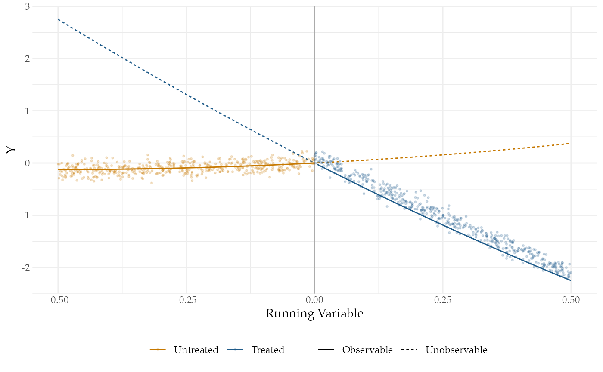

# Regression Discontinuity

Regression discontinuity designs exploit substantive knowledge that
treatment is assigned in a particular way: everyone above a threshold is
assigned to treatment and everyone below it is not. Even though
researchers do not control the assignment, substantive knowledge about
the threshold serves as a basis for a strong identification claim.

Thistlewhite and Campbell introduced the regression discontinuity design
in the 1960s to study the impact of scholarships on academic success.
Their insight was that students with a test score just above a
scholarship cutoff were plausibly comparable to students whose scores
were just below the cutoff, so any differences in future academic
success could be attributed to the scholarship itself.

Regression discontinuity designs identify a *local* average treatment
effect: the average effect of treatment *exactly at the cutoff*. The
main trouble with the design is that there is vanishingly little data
exactly at the cutoff, so any answer strategy needs to use data that is
some distance away from the cutoff. The further away from the cutoff we
move, the larger the threat of bias.

We’ll consider an application of the regression discontinuity design
that examines party incumbency advantage – the effect of a party winning
an election on its vote margin in the next election.

## Design Declaration

- **M**odel:

  Regression discontinuity designs have four components: A running
  variable, a cutoff, a treatment variable, and an outcome. The cutoff
  determines which units are treated depending on the value of the
  running variable.

  In our example, the running variable $`X`$ is the Democratic party’s
  margin of victory at time $`t-1`$; and the treatment, $`Z`$, is
  whether the Democratic party won the election in time $`t-1`$. The
  outcome, $`Y`$, is the Democratic vote margin at time $`t`$. We’ll
  consider a population of 1,000 of these pairs of elections.

  A major assumption required for regression discontinuity is that the
  conditional expectation functions for both treatment and control
  potential outcomes are continuous at the cutoff.[^1] To satisfy this
  assumption, we specify two smooth conditional expectation functions,
  one for each potential outcome. The figure plots $`Y`$ (the Democratic
  vote margin at time $`t`$) against $`X`$ (the margin at time $`t-1`$).
  We’ve also plotted the true conditional expectation functions for the
  treated and control potential outcomes. The solid lines correspond to
  the observed data and the dashed lines correspond to the unobserved
  data.



- **I**nquiry:

  Our estimand is the effect of a Democratic win in an election on the
  Democratic vote margin of the next election, when the Democratic vote
  margin of the first election is zero. Formally, it is the difference
  in the conditional expectation functions of the control and treatment
  potential outcomes when the running variable is exactly zero. The
  black vertical line in the plot shows this difference.

- **D**ata strategy:

  We collect data on the Democratic vote share at time $`t-1`$ and time
  $`t`$ for all 1,000 pairs of elections. There is no sampling or random
  assignment.

- **A**nswer strategy:

  We will approximate the treated and untreated conditional expectation
  functions to the left and right of the cutoff using a flexible
  regression specification estimated via OLS. In particular, we fit each
  regression using a fourth-order polynomial. Much of the literature on
  regression discontinuity designs focuses on the tradeoffs among answer
  strategies, with many analysts recommending against higher-order
  polynomial regression specifications. We use one here to highlight how
  well such an answer strategy does when it matches the functional form
  in the model. We discuss alternative estimators in the exercises.

``` r

N <- 1000
tau <- 0.15
outcome_sd <- 0.1
cutoff <- 0.5
bandwidth <- 0.5
control_coefs <- c(0.5, 0.5)
treatment_coefs <- c(-5, 1)
poly_reg_order <- 4

po_function <- function(X, coefs, tau) {
    as.vector(poly(X, length(coefs), raw = T) %*% coefs) + 
        tau
}
population <- declare_population(N = N, X = runif(N, 0, 1) - 
    cutoff, noise = rnorm(N, 0, outcome_sd), Z = 1 * (X > 
    0))
potential_outcomes <- declare_potential_outcomes(Y_Z_0 = po_function(X, 
    tau = 0, coefs = control_coefs) + noise, Y_Z_1 = po_function(X, 
    tau = tau, coefs = treatment_coefs) + noise)
reveal_Y <- declare_reveal(Y)
estimand <- declare_inquiry(LATE = po_function(X = 0, coefs = treatment_coefs, 
    tau = tau) - po_function(X = 0, coefs = control_coefs, 
    tau = 0))
sampling <- declare_sampling(handler = function(data) {
    subset(data, (X > 0 - abs(bandwidth)) & X < 0 + abs(bandwidth))
})
estimator <- declare_estimator(formula = Y ~ poly(X, poly_reg_order) * 
    Z, .method = lm_robust, term = "Z", inquiry = estimand)
regression_discontinuity_design <- population + potential_outcomes + 
    estimand + reveal_Y + sampling + estimator
```

## Takeaways

We now diagnose the design:

``` r

diagnosis <- diagnose_design(regression_discontinuity_design, sims = 25)
```

    ## Warning: We recommend you choose a number of simulations higher than 30.

| Estimator | Outcome | Term | N Sims | Mean Estimand | Mean Estimate | Bias | SD Estimate | RMSE | Power | Coverage |
|:---|:---|:---|:---|:---|:---|:---|:---|:---|:---|:---|
| estimator | Y | Z | 25 | 0.15 | 0.30 | 0.15 | 0.79 | 0.79 | 0.04 | 0.96 |
|  |  |  |  | (0.00) | (0.16) | (0.16) | (0.12) | (0.12) | (0.04) | (0.04) |

- The power of this design is very low: with 1,000 units we do not
  achieve even 10% statistical power. However, our estimates of the
  uncertainty are not too wide: the coverage probability indicates that
  our confidence intervals indeed contain the estimand 95% of the time
  as they should. Our answer strategy is highly uncertain because the
  second-order polynomial specification in regression model gives
  weights to the data that greatly increase the variance of the
  estimator (Gelman and Imbens, 2017).

- The design is biased because polynomial approximations of the average
  effect at exactly the point of the threshold will be inaccurate in
  small samples (Sekhon and Titiunik, 2017), especially as units farther
  away from the cutoff are incorporated into the answer strategy.

- Finally, from the figure, we can see how poorly the average effect at
  the threshold approximates the average effect for all units. The
  average treatment effect among the treated (to the right of the
  threshold in the figure) is negative, whereas at the threshold it is
  zero This clarifies that the estimand of the regression discontinuity
  design, the difference at the cutoff, is only relevant for a small –
  and possibly empty – set of units very close to the cutoff.

[^1]: An alternative motivation for some designs that do not rely on
    continuity at the cutoff is “local randomization”.
