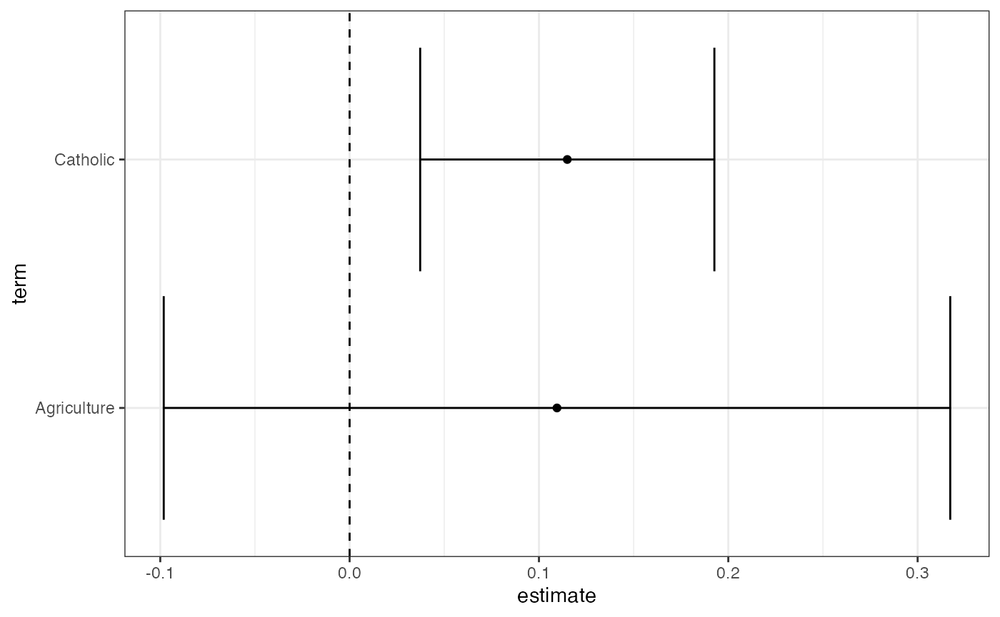
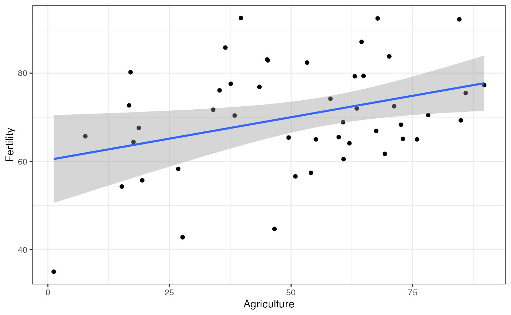
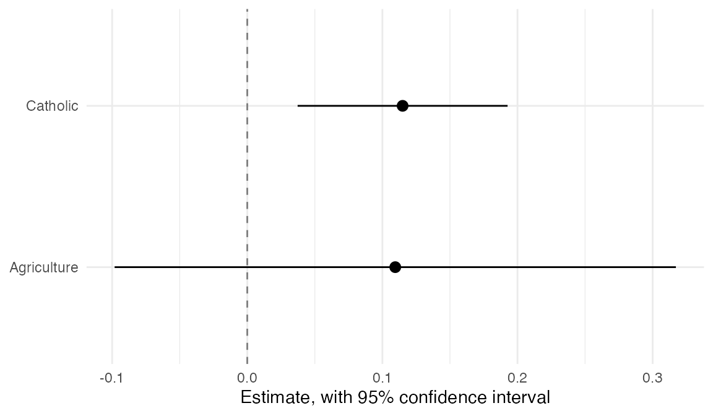
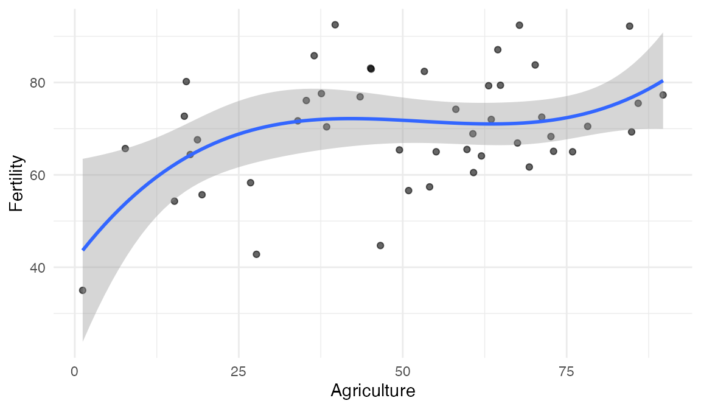
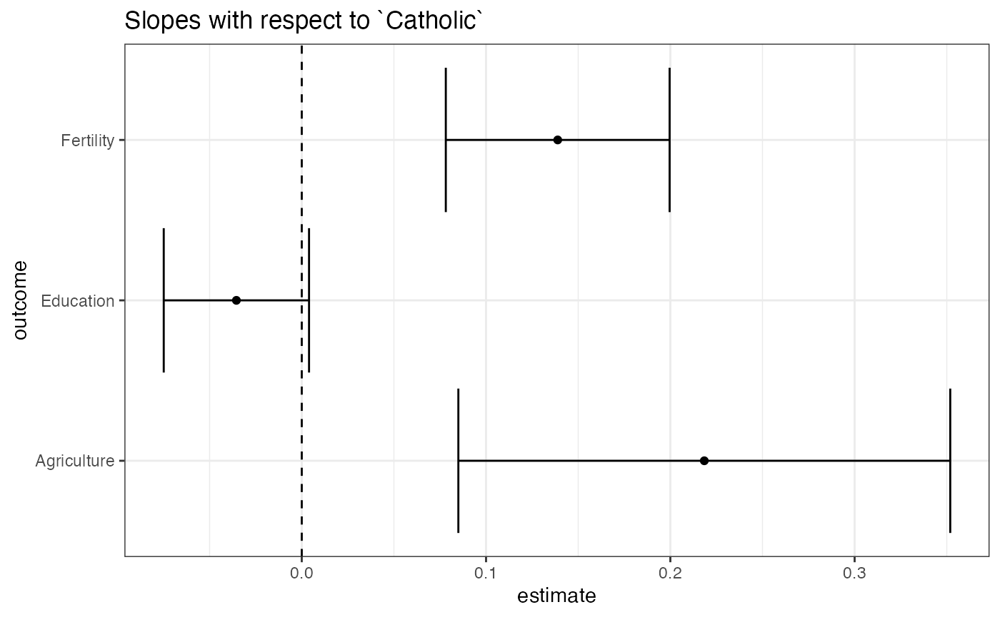

# estimatr in the Tidyverse

`estimatr` is for (fast) OLS and IV regression with robust standard
errors. This document shows how `estimatr` integrates with RStudio’s
`tidyverse` suite of packages.

We use the Swiss Fertility and Socioeconomic Indicators data (available
in `R`, description
[here](https://stat.ethz.ch/R-manual/R-devel/library/datasets/html/swiss.html))
to show how `lm_robust` works with `dplyr`, `ggplot2`, and `purrr`. What
is shown for `lm_robust` here typically applies to all the other
`estimatr` functions (`lm_robust`, `difference_in_mean`, `lm_lin`,
`iv_robust`, and `horovitz_thompson`).

## Getting tidy

The first step to the tidyverse is turning model output into data we can
manipulate. The `tidy` function converts an `lm_robust` object into a
data.frame.

``` r
library(estimatr)
fit <- lm_robust(Fertility ~ Agriculture + Catholic, data = swiss)
tidy(fit)
```

    ##          term   estimate  std.error statistic      p.value    conf.low
    ## 1 (Intercept) 59.8639237 5.47384281 10.936361 3.934173e-14 48.83211840
    ## 2 Agriculture  0.1095281 0.10305115  1.062852 2.936478e-01 -0.09815783
    ## 3    Catholic  0.1149621 0.03854836  2.982283 4.651169e-03  0.03727301
    ##    conf.high df   outcome
    ## 1 70.8957290 44 Fertility
    ## 2  0.3172141 44 Fertility
    ## 3  0.1926512 44 Fertility

## Data manipulation with `dplyr`

Once a regression fit is a data.frame, you can use any of the `dplyr`
“verbs” for data manipulation, like `mutate`,`filter`, `select`,
`summarise`, `group_by`, and `arrange` (more on this
[here](https://dplyr.tidyverse.org)).

``` r
library(tidyverse)

# lm_robust and filter
fit %>% tidy %>% filter(term == "Agriculture")
```

    ##          term  estimate std.error statistic   p.value    conf.low conf.high df
    ## 1 Agriculture 0.1095281 0.1030511  1.062852 0.2936478 -0.09815783 0.3172141 44
    ##     outcome
    ## 1 Fertility

``` r
# lm_robust and select
fit %>% tidy %>% select(term, estimate, std.error)
```

    ##          term   estimate  std.error
    ## 1 (Intercept) 59.8639237 5.47384281
    ## 2 Agriculture  0.1095281 0.10305115
    ## 3    Catholic  0.1149621 0.03854836

``` r
# lm_robust and mutate
fit %>% tidy %>% mutate(t_stat = estimate/ std.error,
                        significant = p.value <= 0.05)
```

    ##          term   estimate  std.error statistic      p.value    conf.low
    ## 1 (Intercept) 59.8639237 5.47384281 10.936361 3.934173e-14 48.83211840
    ## 2 Agriculture  0.1095281 0.10305115  1.062852 2.936478e-01 -0.09815783
    ## 3    Catholic  0.1149621 0.03854836  2.982283 4.651169e-03  0.03727301
    ##    conf.high df   outcome    t_stat significant
    ## 1 70.8957290 44 Fertility 10.936361        TRUE
    ## 2  0.3172141 44 Fertility  1.062852       FALSE
    ## 3  0.1926512 44 Fertility  2.982283        TRUE

## Data visualization with `ggplot2`

`ggplot2` offers a number of data visualization tools that are
compatible with `estimatr`

1.  Make a coefficient plot:

``` r
fit %>% 
  tidy %>% 
  filter(term != "(Intercept)") %>%
  ggplot(aes(y = term, x = estimate)) + 
  geom_vline(xintercept = 0, linetype = 2) + 
  geom_point() + 
  geom_errorbarh(aes(xmin = conf.low, xmax = conf.high, height = 0.1)) + 
  theme_bw()
```



2.  Put CIs based on robust variance estimates (rather than the
    “classical” variance estimates) with the `geom_smooth` and
    `stat_smooth` functions.

``` r
library(ggplot2)
ggplot(swiss, aes(x = Agriculture, y = Fertility)) +
  geom_point() +
  geom_smooth(method = "lm_robust") +
  theme_bw()
```



Note that the functional form can include polynomials. For instance, if
the model is
$Fertility \sim Agriculture + Agriculture^{2} + Agriculture^{3}$, we can
model this in the following way:

``` r
library(ggplot2)
ggplot(swiss, aes(x = Agriculture, y = Fertility)) +
  geom_point() +
  geom_smooth(method = "lm_robust",
              formula = y ~ poly(x, 3, raw = TRUE)) +
  theme_bw()
```



## Bootstrap using `rsample`

The `rsample` pacakage provides tools for bootstrapping:

``` r
library(rsample)

boot_out <-
  bootstraps(data = swiss, 500)$splits %>%
  map(~ lm_robust(Fertility ~ Catholic + Agriculture, data = analysis(.))) %>% 
  map(tidy) %>%
  bind_rows(.id = "bootstrap_replicate")
kable(head(boot_out))
```

| bootstrap_replicate | term        |   estimate | std.error |  statistic |   p.value |   conf.low |  conf.high |  df | outcome   |
|:--------------------|:------------|-----------:|----------:|-----------:|----------:|-----------:|-----------:|----:|:----------|
| 1                   | (Intercept) | 66.6445111 | 6.1805580 | 10.7829278 | 0.0000000 | 54.1884149 | 79.1006074 |  44 | Fertility |
| 1                   | Catholic    |  0.0559302 | 0.0346962 |  1.6119974 | 0.1141134 | -0.0139954 |  0.1258558 |  44 | Fertility |
| 1                   | Agriculture |  0.0613375 | 0.1123003 |  0.5461920 | 0.5876929 | -0.1649889 |  0.2876639 |  44 | Fertility |
| 2                   | (Intercept) | 67.4618025 | 2.7822907 | 24.2468562 | 0.0000000 | 61.8544640 | 73.0691410 |  44 | Fertility |
| 2                   | Catholic    |  0.1720616 | 0.0238761 |  7.2064269 | 0.0000000 |  0.1239424 |  0.2201808 |  44 | Fertility |
| 2                   | Agriculture | -0.0433626 | 0.0515919 | -0.8404923 | 0.4051767 | -0.1473392 |  0.0606140 |  44 | Fertility |

`boot_out` is a data.frame that contains estimates from each boostrapped
sample. We can then use `dplyr` functions to summarize the bootstraps,
`tidyr` functions to reshape the estimates, and
[`GGally::ggpairs`](https://ggobi.github.io/ggally/reference/ggpairs.html)
to visualize them.

``` r
boot_out %>%
  group_by(term) %>%
  summarise(boot_se = sd(estimate))
```

    ## # A tibble: 3 × 2
    ##   term        boot_se
    ##   <chr>         <dbl>
    ## 1 (Intercept)  5.45  
    ## 2 Agriculture  0.102 
    ## 3 Catholic     0.0365

``` r
# To visualize the sampling distribution

library(GGally)
boot_out %>% 
  select(bootstrap_replicate, term, estimate) %>%
  spread(key = term, value = estimate) %>%
  select(-bootstrap_replicate) %>%
  ggpairs(lower = list(continuous = wrap("points", alpha = 0.1))) +
  theme_bw()
```



## Multiple models using `purrr`

`purrr` provides tools to perform the same operation on every element of
a vector. For instance, we may want to estimate a model on different
subsets of data. We can use the `map` function to do this.

``` r
library(purrr)

# Running the same model for highly educated and less educated cantons/districts

two_subsets <- 
  swiss %>%
  mutate(HighlyEducated = as.numeric(Education > 8)) %>%
  split(.$HighlyEducated) %>%
  map( ~ lm_robust(Fertility ~ Catholic, data = .)) %>%
  map(tidy) %>%
  bind_rows(.id = "HighlyEducated")

kable(two_subsets, digits =2)
```

| HighlyEducated | term        | estimate | std.error | statistic | p.value | conf.low | conf.high |  df | outcome   |
|:---------------|:------------|---------:|----------:|----------:|--------:|---------:|----------:|----:|:----------|
| 0              | (Intercept) |    68.41 |      1.89 |     36.27 |    0.00 |    64.50 |     72.31 |  23 | Fertility |
| 0              | Catholic    |     0.14 |      0.03 |      4.20 |    0.00 |     0.07 |      0.20 |  23 | Fertility |
| 1              | (Intercept) |    62.41 |      2.63 |     23.74 |    0.00 |    56.93 |     67.89 |  20 | Fertility |
| 1              | Catholic    |     0.06 |      0.08 |      0.71 |    0.48 |    -0.11 |      0.23 |  20 | Fertility |

Alternatively, we might want to regress different dependent variables on
the same independent variable. `map` can be used alongwith `estimatr`
functions for this purpose as well.

``` r
three_outcomes <-
  c("Fertility", "Education", "Agriculture") %>%
  map(~ formula(paste0(., " ~ Catholic"))) %>%
  map(~ lm_robust(., data = swiss)) %>%
  map_df(tidy)

kable(three_outcomes, digits =2)
```

| term        | estimate | std.error | statistic | p.value | conf.low | conf.high |  df | outcome     |
|:------------|---------:|----------:|----------:|--------:|---------:|----------:|----:|:------------|
| (Intercept) |    64.43 |      1.78 |     36.11 |    0.00 |    60.83 |     68.02 |  45 | Fertility   |
| Catholic    |     0.14 |      0.03 |      4.61 |    0.00 |     0.08 |      0.20 |  45 | Fertility   |
| (Intercept) |    12.44 |      1.73 |      7.20 |    0.00 |     8.96 |     15.92 |  45 | Education   |
| Catholic    |    -0.04 |      0.02 |     -1.81 |    0.08 |    -0.07 |      0.00 |  45 | Education   |
| (Intercept) |    41.67 |      4.46 |      9.35 |    0.00 |    32.69 |     50.65 |  45 | Agriculture |
| Catholic    |     0.22 |      0.07 |      3.30 |    0.00 |     0.08 |      0.35 |  45 | Agriculture |

Using `ggplot2`, we can make a coefficient plot:

``` r
three_outcomes %>%
  filter(term == "Catholic") %>%
  ggplot(aes(x = estimate, y = outcome)) +
  geom_vline(xintercept = 0, linetype = 2) +
  geom_point() + 
  geom_errorbarh(aes(xmin = conf.low, xmax = conf.high, height = 0.1)) + 
  ggtitle("Slopes with respect to `Catholic`") + 
  theme_bw()
```

    ## Warning in geom_errorbar(..., orientation = orientation): Ignoring
    ## unknown aesthetics: height



## Concluding thoughts

Using `estimatr` functions in the tidyverse is easy once the model
outputs have been turned into data.frames. We accomplish this with the
`tidy` function. After that, so many summary and visualization
possibilities open up. Happy tidying!
