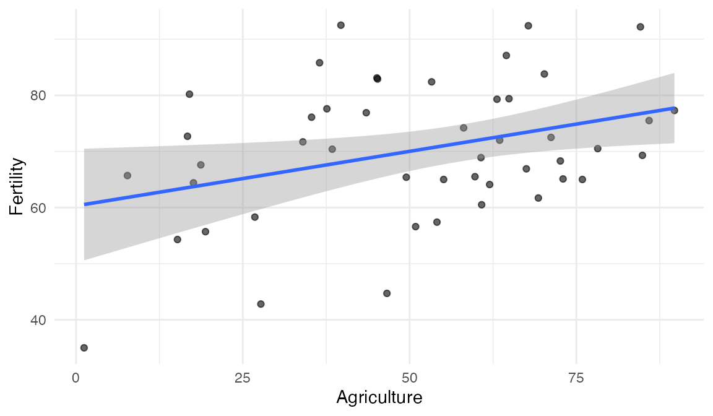
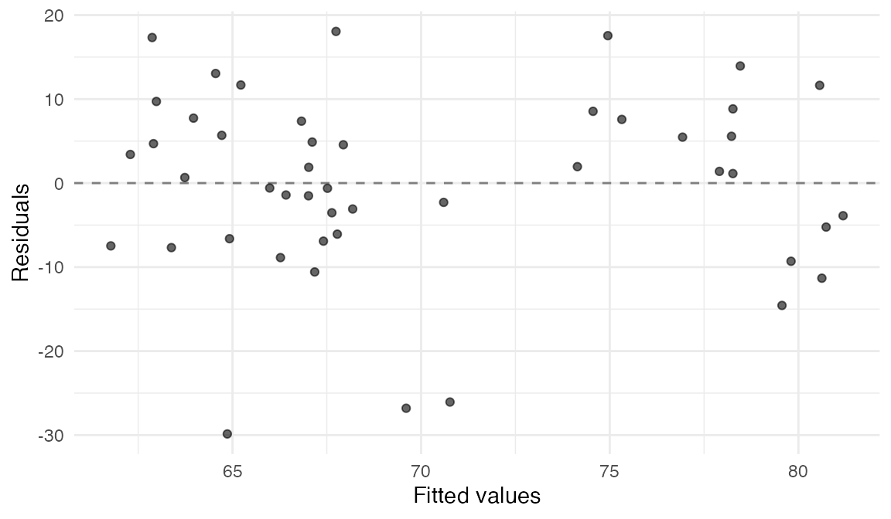

# estimatr in the tidyverse

Everything estimatr returns is a list, and
[`tidy()`](https://generics.r-lib.org/reference/tidy.html) turns the
part you want into a tibble. From there the tidyverse applies unchanged.
What follows uses
[`lm_robust()`](https://declaredesign.org/r/estimatr/reference/lm_robust.md),
but [`tidy()`](https://generics.r-lib.org/reference/tidy.html) works the
same way on
[`lm_lin()`](https://declaredesign.org/r/estimatr/reference/lm_lin.md),
[`iv_robust()`](https://declaredesign.org/r/estimatr/reference/iv_robust.md),
[`lh_robust()`](https://declaredesign.org/r/estimatr/reference/lh_robust.md),
[`difference_in_means()`](https://declaredesign.org/r/estimatr/reference/difference_in_means.md)
and
[`horvitz_thompson()`](https://declaredesign.org/r/estimatr/reference/horvitz_thompson.md)
fits.

The examples use the Swiss fertility data that ships with R: 47
French-speaking provinces in 1888, with a standardized fertility measure
and, as percentages, the share of men in agriculture, the share of
Catholics, and the share educated beyond primary school.

``` r

head(swiss[, c("Fertility", "Agriculture", "Catholic", "Education")], 3)
#>              Fertility Agriculture Catholic Education
#> Courtelary        80.2        17.0     9.96        12
#> Delemont          83.1        45.1    84.84         9
#> Franches-Mnt      92.5        39.7    93.40         5
```

## Getting tidy

``` r

fit <- lm_robust(Fertility ~ Agriculture + Catholic, data = swiss)
tidy(fit)
#> # A tibble: 3 × 9
#>   term        estimate std.error statistic  p.value conf.low conf.high    df outcome  
#>   <chr>          <dbl>     <dbl>     <dbl>    <dbl>    <dbl>     <dbl> <dbl> <chr>    
#> 1 (Intercept)   59.9      5.47       10.9  3.93e-14  48.8       70.9      44 Fertility
#> 2 Agriculture    0.110    0.103       1.06 2.94e- 1  -0.0982     0.317    44 Fertility
#> 3 Catholic       0.115    0.0385      2.98 4.65e- 3   0.0373     0.193    44 Fertility
```

One row per coefficient, and an `outcome` column, which matters because
[`lm_robust()`](https://declaredesign.org/r/estimatr/reference/lm_robust.md)
accepts a matrix of outcomes and fits them all at once.

[`glance()`](https://generics.r-lib.org/reference/glance.html) gives the
one-row model summary instead.

``` r

glance(fit)
#> # A tibble: 1 × 7
#>   r.squared adj.r.squared statistic  p.value df.residual  nobs se_type
#>       <dbl>         <dbl>     <dbl>    <dbl>       <int> <int> <chr>  
#> 1     0.248         0.214      9.89 0.000284          44    47 HC2
```

[`augment()`](https://generics.r-lib.org/reference/augment.html) returns
the data the model was fit on, one row per observation, with the fitted
values and residuals added as `.fitted` and `.resid`. With `newdata`, it
predicts on new rows instead.

``` r

augment(fit)
#> # A tibble: 47 × 5
#>    Fertility Agriculture Catholic .fitted .resid
#>        <dbl>       <dbl>    <dbl>   <dbl>  <dbl>
#>  1      80.2        17       9.96    62.9  17.3 
#>  2      83.1        45.1    84.8     74.6   8.54
#>  3      92.5        39.7    93.4     74.9  17.6 
#>  4      85.8        36.5    33.8     67.7  18.1 
#>  5      76.9        43.5     5.16    65.2  11.7 
#>  6      76.1        35.3    90.6     74.1   1.96
#>  7      83.8        70.2    92.8     78.2   5.57
#>  8      92.4        67.8    97.2     78.5  13.9 
#>  9      82.4        53.3    97.7     76.9   5.47
#> 10      82.9        45.2    91.4     75.3   7.58
#> # ℹ 37 more rows

augment(fit, newdata = data.frame(Agriculture = c(20, 60), Catholic = c(10, 90)))
#> # A tibble: 2 × 3
#>   Agriculture Catholic .fitted
#>         <dbl>    <dbl>   <dbl>
#> 1          20       10    63.2
#> 2          60       90    76.8
```

## dplyr

``` r

library(dplyr)

fit |>
  tidy() |>
  filter(term != "(Intercept)") |>
  mutate(significant = p.value <= 0.05) |>
  select(term, estimate, std.error, significant)
#> # A tibble: 2 × 4
#>   term        estimate std.error significant
#>   <chr>          <dbl>     <dbl> <lgl>      
#> 1 Agriculture    0.110    0.103  FALSE      
#> 2 Catholic       0.115    0.0385 TRUE
```

## ggplot2

A coefficient plot is the tidy tibble with
[`geom_pointrange()`](https://ggplot2.tidyverse.org/reference/geom_linerange.html)
on it.

``` r

library(ggplot2)

gg_df <- fit |>
  tidy() |>
  filter(term != "(Intercept)")

ggplot(gg_df, aes(x = estimate, y = term)) +
  geom_vline(xintercept = 0, linetype = 2, colour = "grey50") +
  geom_pointrange(aes(xmin = conf.low, xmax = conf.high)) +
  labs(x = "Estimate, with 95% confidence interval", y = NULL) +
  theme_minimal()
```


[`geom_smooth()`](https://ggplot2.tidyverse.org/reference/geom_smooth.html)
takes `lm_robust` as a method, so the ribbon reflects the robust
variance rather than the classical one.

``` r

ggplot(swiss, aes(x = Agriculture, y = Fertility)) +
  geom_point(alpha = 0.6) +
  geom_smooth(method = "lm_robust", formula = y ~ x) +
  theme_minimal()
```



The formula can be anything
[`lm_robust()`](https://declaredesign.org/r/estimatr/reference/lm_robust.md)
accepts, polynomials included.

``` r

ggplot(swiss, aes(x = Agriculture, y = Fertility)) +
  geom_point(alpha = 0.6) +
  geom_smooth(method = "lm_robust", formula = y ~ poly(x, 3, raw = TRUE)) +
  theme_minimal()
```


A residual plot starts from
[`augment()`](https://generics.r-lib.org/reference/augment.html).

``` r

gg_df <- augment(fit)

ggplot(gg_df, aes(x = .fitted, y = .resid)) +
  geom_hline(yintercept = 0, linetype = 2, colour = "grey50") +
  geom_point(alpha = 0.6) +
  labs(x = "Fitted values", y = "Residuals") +
  theme_minimal()
```



## Many models with purrr

Fitting the same model on subsets, then stacking the results:

``` r

library(purrr)

swiss |>
  mutate(educated = Education > 8) |>
  split(~ educated) |>
  map(\(d) lm_robust(Fertility ~ Catholic, data = d)) |>
  map(tidy) |>
  list_rbind(names_to = "educated") |>
  filter(term == "Catholic")
#> # A tibble: 2 × 10
#>   educated term     estimate std.error statistic  p.value conf.low conf.high    df outcome
#>   <chr>    <chr>       <dbl>     <dbl>     <dbl>    <dbl>    <dbl>     <dbl> <dbl> <chr>  
#> 1 FALSE    Catholic   0.137     0.0326     4.20  0.000339   0.0697     0.205    23 Fertil…
#> 2 TRUE     Catholic   0.0590    0.0827     0.713 0.484     -0.114      0.232    20 Fertil…
```

For grouped fits, dplyr’s
[`reframe()`](https://dplyr.tidyverse.org/reference/reframe.html) does
the same without leaving the data frame. `pick(everything())` hands each
group’s rows to
[`lm_robust()`](https://declaredesign.org/r/estimatr/reference/lm_robust.md).

``` r

swiss |>
  as_tibble() |>
  mutate(educated = Education > 8) |>
  reframe(tidy(lm_robust(Fertility ~ Catholic, data = pick(everything()))), .by = educated) |>
  filter(term == "Catholic")
#> # A tibble: 2 × 10
#>   educated term     estimate std.error statistic  p.value conf.low conf.high    df outcome
#>   <lgl>    <chr>       <dbl>     <dbl>     <dbl>    <dbl>    <dbl>     <dbl> <dbl> <chr>  
#> 1 TRUE     Catholic   0.0590    0.0827     0.713 0.484     -0.114      0.232    20 Fertil…
#> 2 FALSE    Catholic   0.137     0.0326     4.20  0.000339   0.0697     0.205    23 Fertil…
```

Fitting different outcomes on the same regressor is the same move after
a reshape: stack the outcomes long, nest by outcome, and fit within
each.

``` r

library(tidyr)

swiss |>
  pivot_longer(c(Fertility, Education, Agriculture),
               names_to = "outcome_variable",
               values_to = "Y") |>
  nest(.by = outcome_variable) |>
  mutate(fit = map(data, \(d) tidy(lm_robust(Y ~ Catholic, data = d)))) |>
  unnest(fit)
#> # A tibble: 6 × 11
#>   outcome_variable data     term  estimate std.error statistic  p.value conf.low conf.high
#>   <chr>            <list>   <chr>    <dbl>     <dbl>     <dbl>    <dbl>    <dbl>     <dbl>
#> 1 Fertility        <tibble> (Int…  64.4       1.78       36.1  7.14e-35  60.8     68.0    
#> 2 Fertility        <tibble> Cath…   0.139     0.0301      4.61 3.37e- 5   0.0782   0.200  
#> 3 Education        <tibble> (Int…  12.4       1.73        7.20 5.11e- 9   8.96    15.9    
#> 4 Education        <tibble> Cath…  -0.0355    0.0196     -1.81 7.66e- 2  -0.0749   0.00395
#> 5 Agriculture      <tibble> (Int…  41.7       4.46        9.35 4.15e-12  32.7     50.7    
#> 6 Agriculture      <tibble> Cath…   0.218     0.0663      3.30 1.92e- 3   0.0850   0.352  
#> # ℹ 2 more variables: df <dbl>, outcome <chr>
```

[`lm_robust()`](https://declaredesign.org/r/estimatr/reference/lm_robust.md)
also accepts several outcomes in one call using `cbind`, which is faster
because the design matrix is factorized once. Be careful if missingness
differs across outcomes because the `cbind` triggers listwise deletion.

``` r

lm_robust(cbind(Fertility, Education, Agriculture) ~ Catholic, data = swiss) |>
  tidy()
#> # A tibble: 6 × 9
#>   term        estimate std.error statistic  p.value conf.low conf.high    df outcome    
#>   <chr>          <dbl>     <dbl>     <dbl>    <dbl>    <dbl>     <dbl> <dbl> <chr>      
#> 1 (Intercept)  64.4       1.78       36.1  7.14e-35  60.8     68.0        45 Fertility  
#> 2 Catholic      0.139     0.0301      4.61 3.37e- 5   0.0782   0.200      45 Fertility  
#> 3 (Intercept)  12.4       1.73        7.20 5.11e- 9   8.96    15.9        45 Education  
#> 4 Catholic     -0.0355    0.0196     -1.81 7.66e- 2  -0.0749   0.00395    45 Education  
#> 5 (Intercept)  41.7       4.46        9.35 4.15e-12  32.7     50.7        45 Agriculture
#> 6 Catholic      0.218     0.0663      3.30 1.92e- 3   0.0850   0.352      45 Agriculture
```

## Bootstrapping

[rsample](https://rsample.tidymodels.org), from tidymodels, draws the
resamples:
[`bootstraps()`](https://rsample.tidymodels.org/reference/bootstraps.html)
returns a tibble with one resample per row, and
[`analysis()`](https://rsample.tidymodels.org/reference/as.data.frame.rsplit.html)
extracts each one’s data. Because
[`tidy()`](https://generics.r-lib.org/reference/tidy.html) output
stacks, the rest is a
[`map()`](https://purrr.tidyverse.org/reference/map.html) and an
[`unnest()`](https://tidyr.tidyverse.org/reference/unnest.html).

``` r

library(rsample)

set.seed(343)

boot <- bootstraps(swiss, times = 200) |>
  mutate(coefs = map(splits, \(split) {
    analysis(split) |>
      lm_robust(Fertility ~ Catholic + Agriculture, data = _) |>
      tidy()
  }))

boot |>
  unnest(coefs) |>
  group_by(term) |>
  summarise(bootstrap_se = sd(estimate))
#> # A tibble: 3 × 2
#>   term        bootstrap_se
#>   <chr>              <dbl>
#> 1 (Intercept)       4.81  
#> 2 Agriculture       0.0925
#> 3 Catholic          0.0365

# for comparison against HC2
lm_robust(Fertility ~ Catholic + Agriculture, data = swiss) |>
  tidy() |>
  select(term, std.error)
#> # A tibble: 3 × 2
#>   term        std.error
#>   <chr>           <dbl>
#> 1 (Intercept)    5.47  
#> 2 Catholic       0.0385
#> 3 Agriculture    0.103
```

The bootstrap standard errors and the HC2 standard errors are close,
which is the expected result.
