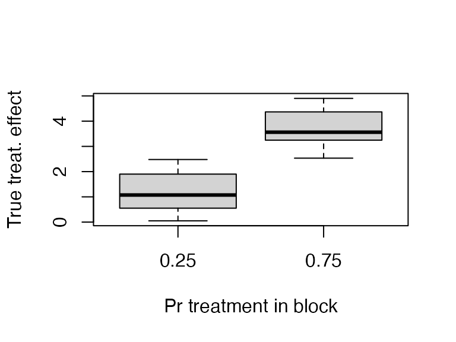

# Simulations - Debiasing Difference-in-Means

This document shows how providing
[`estimatr`](https://declaredesign.org/r/estimatr/) with the appropriate
blocks and clusters that define a research design can eliminate bias
when estimating treatment effects using
[`difference_in_means()`](https://declaredesign.org/r/estimatr/reference/difference_in_means.md).
More details about the estimators with references can be found in the
[mathematical
notes](https://declaredesign.org/r/estimatr/articles/mathematical-notes.md).

I am going to skip simple difference-in-means, and just straight to the
case with blocks. Throughout I will use
[`DeclareDesign`](https://declaredesign.org/r/declaredesign/) to help
diagnose the properties of the various estimators.

``` r

library(DeclareDesign)
```

## Blocked designs

Blocking is a common strategy in experimental design used to improve the
efficiency of estimators by ensuring that units with similar potential
outcomes, when blocked, will be represented in both treatment
conditions.

### Fixed probability of treatment

Let’s first consider an example where blocks predict the potential
outcomes but where the probability of treatment is constant across
blocks. In this case, estimating a simple difference-in-means without
passing the information about the blocks will not bias the estimate, but
it will not take advantage of the increased efficiency blocking provides
and the standard errors will be unnecessarily large. Let’s see that in
an example.

First, let’s set up our data and randomization scheme. In all of these
analyses, our estimand will be the average treatment effect

``` r

# Define population with blocks of the same size, with some block-level shock
simp_blocks <- declare_model(
  blocks = add_level(
    N = 40,
    block_shock = runif(N, 0, 10)
  ),
  individual = add_level(
    N = 8,
    epsilon = rnorm(N),
    # Block shocks influnce Y_Z_1, the treatment potential outcome
    potential_outcomes(Y ~ Z * 0.5 * block_shock + epsilon)
  )
)
# Complete random assignment of half of units in each block
blocked_assign <- declare_assignment(Z = block_ra(blocks = blocks, prob = 0.5))
# Estimand is the ATE
ate <- declare_inquiry(ATE = mean(Y_Z_1 - Y_Z_0))
outcomes <- declare_measurement(Y = reveal_outcomes(Y ~ Z))
```

Now let’s define our two estimators, one that doesn’t account for
blocking and one that does. The estimator that accounts for blocking
essentially will compute treatment effects within blocks and then will
take a weighted average across blocks. Details and references can be
found in the [mathematical
notes](https://declaredesign.org/r/estimatr/articles/mathematical-notes.html#difference_in_means-notes).

``` r

dim <- declare_estimator(Y ~ Z, inquiry = "ATE", label = "DIM")
dim_bl <- declare_estimator(Y ~ Z, .method = difference_in_means, blocks = blocks, inquiry = "ATE", label = "DIM blocked")

# Our design
simp_bl_des <- simp_blocks +
  blocked_assign +
  ate +
  outcomes + 
  dim +
  dim_bl

# Our diagnosands of interest
my_diagnosands <- declare_diagnosands(
  `Bias` = mean(estimate - estimand),
  `Coverage` =  mean(estimand <= conf.high & estimand >= conf.low),
  `Mean of Estimated ATE` = mean(estimate),
  `Mean of True ATE (Estimand)` = mean(estimand),
  `Mean Standard Error` = mean(std.error)
)
```

Let’s get a sample dataset to show the relationship between treatment
potential outcomes and blocks.

``` r

set.seed(42)
dat <- draw_data(simp_bl_des)
plot(dat$blocks, dat$Y_Z_1,
     ylab = "Y_Z_1 (treatment PO)", xlab = "Block ID")
```


As you can see, the blocks tend to have clustered treatment potential
outcomes. Now let’s compare the performance of the two estimators using
our diagnosands of interest.

``` r

set.seed(42)
simp_bl_dig <- diagnose_design(
  simp_bl_des,
  sims = 500,
  diagnosands = my_diagnosands
)
```

|                             | Naive DIM | Block DIM |
|:----------------------------|----------:|----------:|
| Mean of True ATE (Estimand) |     2.506 |     2.506 |
| Mean of Estimated ATE       |     2.505 |     2.505 |
| Bias                        |     0.000 |     0.000 |
| se(Bias)                    |     0.002 |     0.002 |
| Coverage                    |     0.995 |     0.949 |
| se(Coverage)                |     0.001 |     0.003 |
| Mean Standard Error         |     0.159 |     0.112 |
| se(Mean Standard Error)     |     0.000 |     0.000 |

Both estimates are unbiased (and indeed are identical), and you can see
that standard errors when accounting for blocking are much smaller
(leading to better coverage and more efficient estimation). Note that
the `"se"` rows in the table describe the uncertainty arising from the
simulation and can help us know well we estimated our bias and variance
using the simulation approach.

### Correlated potential outcomes and treatment probabilities

However, not accounting for blocking becomes more problematic if the
probability of treatment in each block is correlated with the potential
outcomes. Imagine, for example, that you are working with a partner who
wants their intervention to both have a big effect and be amenable to
rigorous analysis (in which case, congratulations). In this scenario,
they may suspect certain types of units have higher treatment effects
and want those units to be treated more often. In this case, if blocks
with higher treatment effects are treated more often, the naive
estimator will overrepresent those treated units and upwardly bias the
ATE. Accounting for blocking by estimating treatment effects within
block and then weighting for the probability of treatment, which our
[`difference_in_means()`](https://declaredesign.org/r/estimatr/reference/difference_in_means.md)
estimator does when blocks are specified, will eliminate this bias.

``` r

corr_blocks <- declare_model(
  blocks = add_level(
    N = 60,
    block_shock = runif(N, 0, 10),
    indivs_per_block = 8,
    # if block shock is > 5, treat 6 units, otherwise treat 2
    m_treat = ifelse(block_shock > 5, 6, 2)
  ),
  individual = add_level(
    N = indivs_per_block,
    epsilon = rnorm(N, sd = 3)
    
  )
) + 
  declare_model(potential_outcomes(Y ~ Z * 0.5 * block_shock + epsilon))
# Use same potential outcomes as above, but now treatment probability varies across blocks
corr_blocked_assign <- declare_assignment(
  Z = block_ra(
    blocks = blocks,
    # The next line will just get the number of treated for a block from
    # the first unit in that block
    block_m = m_treat[!duplicated(blocks)]
  ),
  legacy = FALSE
)
corr_bl_des <- 
  corr_blocks +
  corr_blocked_assign +
  ate +
  outcomes +
  dim +
  dim_bl
```

As you can see below, the probability of treatment is strongly
correlated with the treatment effect.

``` r

set.seed(43)
dat <- draw_data(corr_bl_des)
plot(factor(dat$m_treat / 8), dat$Y_Z_1 - dat$Y_Z_0,
     ylab = "True treat. effect", xlab = "Pr treatment in block")
```



Let’s diagnose these estimators.

``` r

set.seed(44)
corr_bl_dig <- diagnose_design(
  corr_bl_des,
  sims = 500,
  diagnosands = my_diagnosands
)
corr_bl_dig$simulations <- NULL
```

|                             | Naive DIM | Block DIM |
|:----------------------------|----------:|----------:|
| Mean of True ATE (Estimand) |     2.502 |     2.502 |
| Mean of Estimated ATE       |     3.119 |     2.499 |
| Bias                        |     0.617 |    -0.003 |
| se(Bias)                    |     0.005 |     0.005 |
| Coverage                    |     0.421 |     0.944 |
| se(Coverage)                |     0.008 |     0.004 |
| Mean Standard Error         |     0.287 |     0.316 |
| se(Mean Standard Error)     |     0.000 |     0.000 |

As you can see, the bias and coverage are all wrong for the naive
difference in means, while our corrected estimator has no bias and the
coverage is closer to the nominal level.

## Clustered designs

Another common design involves clustered treatment assignment, where
units are can only be treated in groups. This often arises when
treatments only can happen at the classroom, village, or some other
aggregated level, but you can observe outcomes at a lower level, such as
a student in a classroom or a voter in a village.

### Clusters of the same size

With clustered designs, the naive difference-in-means estimate of the
ATE will be unbiased. However, if the potential outcomes are correlated
with cluster, than the naive standard error will underestimate the
standard error. This is because the sampling variability of the
estimated ATE is greater when certain clusters with similar potential
outcomes will be in the same treatment status across runs. If you pass
`clusters` to our difference-in-means estimator, we properly account for
this increase in the sampling variability.

Let’s see this in action.

``` r

# Define clustered data
simp_clusts <- declare_model(
  clusters = add_level(
    N = 40,
    clust_shock = runif(N, 0, 10)
  ),
  individual = add_level(
    N = 8,
    epsilon = rnorm(N),
    # Treatment potential outcomes correlated with cluster shock
    potential_outcomes(Y ~ Z * 0.2 * clust_shock + epsilon)
  )
)

# Clustered assignment to treatment
clustered_assign <- declare_assignment(Z = cluster_ra(clusters = clusters, prob = 0.5), legacy = FALSE)

ate <- declare_inquiry(ATE = mean(Y_Z_1 - Y_Z_0))

# Specify our two estimators
dim <- declare_estimator(Y ~ Z, label = "DIM")
dim_cl <- declare_estimator(Y ~ Z, clusters = clusters, label = "DIM clustered")

simp_cl_des <- simp_clusts +
  clustered_assign +
  ate +
  outcomes + 
  dim +
  dim_cl
```

Let’s look at an example of the data generated by this design. As you
can see, treatment is clustered.

``` r

set.seed(45)
dat <- draw_data(simp_cl_des)
table(Z = dat$Z, clusters = dat$clusters)
```

    ##    clusters
    ## Z   01 02 03 04 05 06 07 08 09 10 11 12 13 14 15 16 17 18 19 20 21 22 23 24 25
    ##   0  0  0  0  8  8  8  8  8  8  0  0  0  0  8  8  8  0  0  0  8  8  8  8  0  0
    ##   1  8  8  8  0  0  0  0  0  0  8  8  8  8  0  0  0  8  8  8  0  0  0  0  8  8
    ##    clusters
    ## Z   26 27 28 29 30 31 32 33 34 35 36 37 38 39 40
    ##   0  8  0  0  8  0  8  0  0  8  8  8  0  8  0  0
    ##   1  0  8  8  0  8  0  8  8  0  0  0  8  0  8  8

Furthermore, treatment potential outcomes are correlated with cluster.

``` r

plot(dat$clusters, dat$Y_Z_1,
     ylab = "Y_Z_1 (treatment PO)", xlab = "Cluster ID")
```


Let’s diagnose this design.

``` r

set.seed(46)
simp_cl_dig <- diagnose_design(
  simp_cl_des,
  sims = 500,
  diagnosands = my_diagnosands
)
```

|                             | Naive DIM | Cluster DIM |
|:----------------------------|----------:|------------:|
| Mean of True ATE (Estimand) |     1.002 |       1.002 |
| Mean of Estimated ATE       |     1.007 |       1.007 |
| Bias                        |     0.004 |       0.004 |
| se(Bias)                    |     0.002 |       0.002 |
| Coverage                    |     0.899 |       0.978 |
| se(Coverage)                |     0.004 |       0.002 |
| Mean Standard Error         |     0.120 |       0.170 |
| se(Mean Standard Error)     |     0.000 |       0.000 |

As you can see, the estimates are the same but the coverage for the
naive difference-in-means is below the nominal level of 95 percent. The
design-aware difference-in-means that accounts for clustering is
conservative and in this case is a more appropriate estimator.

### Clusters of different sizes

When clusters are different sizes, and potential outcomes are correlated
with cluster size, the difference-in-means estimator is no longer
appropriate as it is biased. One solution is to use the Horvitz-Thompson
estimator, which is actually a difference-in-totals estimator.

In the below, I use simulation to show that the difference-in-means
estimator cannot account for the correlation between cluster size and
potential outcomes, while the Horvitz-Thompson estimator can.

``` r

# Correlated cluster size and potential outcomes
diff_size_cls <- declare_model(
  clusters = add_level(
    N = 10,
    clust_shock = runif(N, 0, 10),
    indivs_per_clust = ceiling(clust_shock),
    condition_pr = 0.5
  ),
  individual = add_level(
    N = indivs_per_clust,
    epsilon = rnorm(N, sd = 3)
  )
) + 
  declare_model(potential_outcomes(Y ~ Z * 0.4 * clust_shock + epsilon))
clustered_assign <- declare_assignment(Z = cluster_ra(clusters = clusters, prob = 0.5))

ht_cl <- declare_estimator(
  formula = Y ~ Z,
  clusters = clusters,
  condition_prs = condition_pr,
  simple = FALSE,
  .method = estimatr::horvitz_thompson,
  inquiry = "ATE",
  label = "Horvitz-Thompson Clustered"
)

ate <- declare_inquiry(ATE = mean(Y_Z_1 - Y_Z_0))

diff_cl_des <- diff_size_cls + 
  clustered_assign + 
  ate + 
  outcomes

dat <- draw_data(diff_cl_des)
ht_cl(dat)
```

    ##                    estimator term estimate std.error statistic   p.value
    ## 1 Horvitz-Thompson Clustered    Z 2.728959  2.096487  1.301682 0.1930251
    ##    conf.low conf.high df outcome inquiry
    ## 1 -1.380079  6.837997 NA       Y     ATE

``` r

diff_cl_des <- diff_size_cls + 
  clustered_assign + 
  ate + 
  outcomes + 
  dim_cl + 
  ht_cl
```

Now let’s diagnose!

``` r

set.seed(47)
diff_cl_dig <- diagnose_design(
  diff_cl_des,
  sims = 500,
  diagnosands = my_diagnosands
)
```

|                             | Cluster DIM | Clust. Horvitz-Thompson |
|:----------------------------|------------:|------------------------:|
| Mean of True ATE (Estimand) |       2.555 |                   2.555 |
| Mean of Estimated ATE       |       2.505 |                   2.554 |
| Bias                        |      -0.049 |                  -0.001 |
| se(Bias)                    |       0.004 |                   0.005 |
| Coverage                    |       0.959 |                   0.955 |
| se(Coverage)                |       0.001 |                   0.001 |
| Mean Standard Error         |       0.918 |                   1.476 |
| se(Mean Standard Error)     |       0.001 |                   0.002 |

As you can see, the Horvitz-Thompson estimate is unbiased while the DIM
is biased (observe how the standard error of the DIM bias is much
smaller than the bias, while the Horvitz-Thompson bias is much smaller
than the standard error of the bias).

Unfortunately, the cost of this lower bias is much higher variance. If
you look at the Mean Standard Error, you’ll see that the standard error
for the Horvitz-Thompson estimator is on average over 50 percent greater
than the standard error for the biased difference-in-means estimator.
